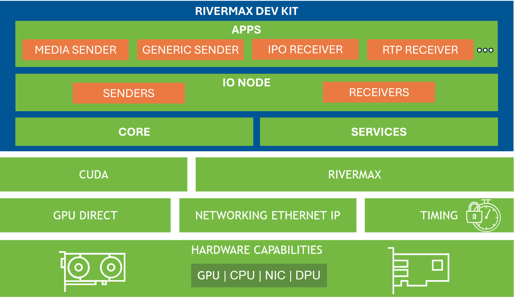

# Rivermax Dev Kit

Rivermax Dev Kit is a high-level C++ SW kit designed to accelerate and simplify Rivermax application development.

## Overview

### Introduction

[NVIDIA® Rivermax®](https://developer.nvidia.com/networking/rivermax-getting-started) offers a unique IP-based solution for media and data streaming use cases. Combined with NVIDIA GPU accelerated computing technologies, Rivermax unlocks innovation for applications in Media and Entertainment, Broadcast, Healthcare, Smart Cities and more.

Leveraging NVIDIA ConnectX® and DPU hardware streaming accelerations and direct data transfers to and from the GPU, Rivermax delivers best-in-class throughput and latency with minimal CPU utilization for streaming workloads.

The **Rivermax Dev Kit** is designed to simplify Rivermax application development by offering a high-level C++ API for core Rivermax components, intuitive abstractions, and developer-friendly services. It facilitates seamless handling of media and generic streams through flexible IO nodes that support diverse streaming workflows.
Additionally, it includes SW APIs for application-level modules to enhance functionality at application level. Finally, it provides CLI apps for quick testing and demonstration, making it an ideal solution for a wide range of streaming use cases.

### Key Features

- Simplified application-level interfaces for sending and receiving generic or media streams.
- Flexible IO nodes for managing diverse data-path streaming workflows.
- High-level C++ APIs with abstractions for seamless interaction with core Rivermax components.
- Built-in services for easy development, such as memory management, RTP buffering, and media frame handling.

### Software Stack

The Rivermax Dev Kit integrates seamlessly into the Rivermax software stack:<br><br>
<br>

## Getting Started

### Module Organization and Namespace Structure

The kit is organized into four primary modules, each with its corresponding namespace:

- **Apps**: Application-level functionality (`rivermax::dev_kit::apps`)
- **IO Node**: Input/output management (`rivermax::dev_kit::io_node`)
- **Services**: Supporting services (`rivermax::dev_kit::services`)
- **Core**: Essential C++ Rivermax components and interfaces (`rivermax::dev_kit::core`)

All modules are contained within the main `rivermax` namespace, which contains the `dev_kit` namespace.

### API Usage

The Rivermax Dev Kit provides flexible options for including its API and linking its components, allowing you to tailor your development setup to your specific needs. Choose the approach that best fits your application requirements.

#### Including the API

You can include the Rivermax Dev Kit API in your application using one of the following approaches:

##### Single Header Inclusion

For simplicity, include the entire API with a single header file:

```cpp
#include "rdk/rivermax_dev_kit.h"
```

##### Modular Inclusion

If your application requires only specific modules, include them individually to reduce dependencies:

```cpp
#include "rdk/apps/apps.h"
#include "rdk/io_node/io_node.h"
#include "rdk/services/services.h"
#include "rdk/core/core.h"
```

##### Fine-Grained Inclusion

For minimal dependencies, include only the specific components you need, for example:

```cpp
#include "rdk/services/memory_allocation/memory_allocation.h"
#include "rdk/core/stream/send/media_stream.h"
```

#### Linking the Components

To ensure proper compilation and linking, you can choose between linking the entire Rivermax Dev Kit or specific components, depending on your application's requirements.

##### Linking the Entire Dev Kit

For simplicity and access to all features, link the entire Rivermax Dev Kit. This approach is ideal for applications that require comprehensive functionality without the need for fine-grained modularity. For example, in CMake:

```cmake
target_link_libraries(<your-target> PRIVATE rivermax-dev-kit)
```

##### Linking Specific Components

If your application requires only specific modules, you can link individual libraries to reduce dependencies and optimize the build process. For example:

```cmake
target_link_libraries(<your-target> PRIVATE rivermax-dev-kit-core)
```

This approach allows you to include only the necessary components, providing greater control over your application's dependencies.

### Using Rivermax Dev Kit in External Applications

You can integrate the Rivermax Dev Kit into your external applications using CMake by fetching and linking prebuilt archive files. Below is an example configuration for an application with `app.cpp` as the main source file and an `include` directory for header files:

```cmake
cmake_minimum_required(VERSION 3.19)

project(rivermax-dev-kit-external-app)

include(FetchContent)

message(STATUS "Fetching rivermax-dev-kit")
FetchContent_Declare(
    rivermax-dev-kit
    URL https://github.com/NVIDIA/rivermax-dev-kit/archive/<GIT_HASH/GIT_TAG>.zip
)
FetchContent_MakeAvailable(rivermax-dev-kit)

add_executable(${PROJECT_NAME} ${CMAKE_CURRENT_SOURCE_DIR}/source/app.cpp)

target_link_libraries(${PROJECT_NAME} PRIVATE <rivermax-dev-kit-target>)
```

Replace `<GIT_HASH/GIT_TAG>` with the appropriate commit hash or tag for the Rivermax Dev Kit repository.<br>
Replace `<rivermax-dev-kit-target>` with the appropriate target name for the Rivermax Dev Kit module you want to link against.

## Development

### Prerequisites

#### Platform Requirements

To develop and compile the Rivermax Dev Kit, you need a supported hardware, operating system, and driver configuration. For a complete list of supported platforms, refer to the [Supported Platforms](#supported-platforms) section.

#### Installing Rivermax Library

To use the Rivermax Dev Kit, you need to have the Rivermax library installed on your system. The Rivermax library is available for both Linux and Windows platforms. You can find the installation instructions and download links on the [NVIDIA Rivermax Getting Started](https://developer.nvidia.com/networking/rivermax-getting-started) page.

#### Build Tools

The Rivermax Dev Kit uses [CMake](https://cmake.org/download/), a versatile cross-platform build system generator. CMake simplifies project configuration and builds by using `CMakeLists.txt` files to generate input files for various build systems, such as [MSBuild](https://learn.microsoft.com/en-us/visualstudio/msbuild/msbuild) on Windows or Unix Makefiles on Linux.

> Note: While CMake supports many build systems, only MSBuild and Unix Makefiles have been explicitly tested with the Rivermax Dev Kit.

##### Installing Latest CMake

In most cases the platforms supported by Rivermax come with the sufficient version of CMake (version 3.19).

The newest version of CMake can be downloaded directly from [CMake Official Download Page](https://cmake.org/download/).

On Windows, one should take the following steps:

1. Visit the CMake official download page: <https://cmake.org/download/>
2. Download and install the latest version of "Windows x64 Installer" for CMake

On Linux, one should take the following steps:

1. Download the latest version of CMake installation bash-script e.g.:
```sh
wget https://github.com/Kitware/CMake/releases/download/v3.26.4/cmake-3.26.4-linux-x86_64.sh -O cmake.sh
```
2. Install CMake by running the script with the following command-line arguments:
```sh
sudo sh cmake.sh --prefix=/usr/local/ --exclude-subdir
```

> There is an alternative method of installing CMake, which is via python pip: `pip3 install cmake`

##### Build Tools on Windows

On Windows, you can set up the build environment for Rivermax Dev Kit using one of the following options:

1. Install [MSBuild](https://learn.microsoft.com/en-us/visualstudio/msbuild/msbuild).
2. Install [Microsoft Visual Studio](https://visualstudio.microsoft.com/vs/).

> Note: CMake supports various IDEs on Windows. For example, you can use Visual Studio Code with MSBuild as a lightweight and cost-effective alternative to Visual Studio.

##### Build Tools on Linux

The packages needed for development on Linux can be installed using the following command lines.

_On Debian-based distros_:

```sh
sudo apt update
sudo apt install build-essential gdb manpages-dev autoconf libtool -y
sudo apt install libnl-3-dev libnl-genl-3-dev libcap-dev -y
```

For CUDA support, you need to install the following packages:

```sh
sudo apt install libgl-dev freeglut3-dev -y
```

_On RHEL-based distros_:

```sh
sudo yum install gcc gcc-c++ glibc-devel make glibc-devel -y
sudo yum install autoconf libtool man man-pages -y
sudo yum install libnl3-devel libcap-devel -y
```

For CUDA support, you need to install the following packages:

```sh
sudo yum install mesa-libGL-devel freeglut-devel -y
```

> RedHat's `libcap-devel` package does not contain `libcap.a` static library,
> which needs to be built directly from sources.

To download, build and install the `libcap.a` static library from sources
one shall invoke the following command:

```sh
sudo su
cd /tmp && wget https://mirrors.edge.kernel.org/pub/linux/libs/security/linux-privs/libcap2/libcap-2.48.tar.gz && \
    tar xzvf libcap-2.48.tar.gz && cd libcap-2.48 && \
    make && make install && \
    cd - && rm -rf /tmp/libcap-2.48*
```

#### Development IDE

Rivermax Dev Kit leverages CMake for its build system, offering flexibility in choosing an Integrated Development Environment (IDE). CMake can generate project files for a variety of IDEs, including Microsoft Visual Studio Code, ensuring smooth integration and a streamlined development experience.

### Building

#### Building Rivermax Dev Kit

1. Initialize build environment in an output directory `<build-dir>` of your choice:

```sh
cmake -B <build-dir> -DCMAKE_BUILD_TYPE=Release
```
To compile with CUDA support, add `-DRMAX_CUDA=ON` to `cmake` command-line. `nvcc`
must be in `PATH`; you can add it using `export PATH=$PATH:/usr/local/cuda/bin/` on Linux, or
`set PATH=%PATH%;<CUDA_INSTALL_DIR>\bin` on Windows.

2. After the build environment is set in output directory `<build-dir>`,
   build Rivermax Dev Kit with the following command-line:

```sh
cmake --build <build-dir> --config Release --parallel
```

#### Command Line Arguments

Building command line may accept a set of configuration arguments.
The list of these arguments can be obtained using the following command-line:

```sh
cmake -B <build-dir> -LH
```

## CLI Applications

The Rivermax Dev Kit includes a set of command-line interface (CLI) applications that serve as CLI binaries for the app modules.
These applications are designed to demonstrate the functionality of the Rivermax Dev Kit and provide a convenient way to interact with its features.
After building the Rivermax Dev Kit, you can find the CLI applications in the `<build-dir>/source/apps` directory.
Each application is organized into its own subdirectory, and the executable files are named according to the corresponding folder names.

Each CLI application is designed to showcase specific features and capabilities of the Rivermax Dev Kit. You can run these applications from the command line to test and explore the functionality of the Rivermax Dev Kit.

In addition to being available as CLI interfaces, these applications are also accessible as software APIs within the `apps` module. This allows developers to integrate the same functionality directly into their own applications, providing flexibility for both standalone usage and embedded development.

## Documentation

The Rivermax Dev Kit includes comprehensive documentation that can be generated using Doxygen and CMake. This documentation includes comprehensive details about the API, its modules, and components, providing a clear reference for developers.

### Prerequisites for Generating Documentation

To build the documentation, ensure that Doxygen version 1.9.8 or later is installed. You can obtain Doxygen from the [official Doxygen website](https://www.doxygen.nl/download.html) or install it via your operating system's package manager.

For Linux, you can install Doxygen using the following commands:

- **Debian/Ubuntu-based systems**:
    ```sh
    sudo apt install doxygen
    ```

- **RHEL/CentOS/Fedora-based systems**:
    ```sh
    sudo dnf install doxygen
    ```

### Steps to Build Documentation

The API documentation is not built by default, and thus shall be built explicitly. To generate the documentation, run the following command:

```sh
cmake --build <build-dir> --target rivermax_dev_kit_docs
```

### Accessing Documentation

Once the documentation is built, you can view it by opening the `index.html` file located in the `<build-dir>/docs/doxygen/html` directory. Use any web browser to explore the generated HTML documentation.


## Supported Platforms

The Rivermax Dev Kit is designed to work seamlessly with the Rivermax library, supporting both Linux and Windows operating systems. It is compatible with deployment in bare-metal and virtualized environments.

- **Linux**: The Dev Kit operates with the DOCA Host driver stack.
- **Windows**: The Dev Kit is built on the WinOF-2 driver stack.

For a detailed list of supported platforms and configurations, refer to the [Supported Platforms](https://developer.nvidia.com/networking/rivermax-getting-started) section on the NVIDIA Rivermax Developer website.

## Support

For assistance or additional information about Rivermax, visit the official [NVIDIA Rivermax Getting Started](https://developer.nvidia.com/networking/rivermax-getting-started) page. It provides comprehensive documentation and access to support channels.
